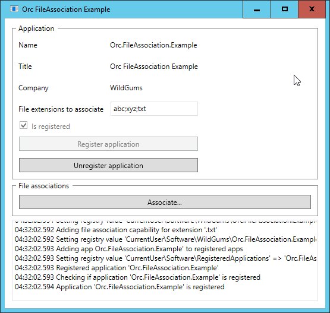
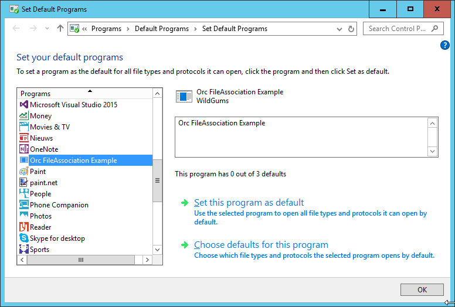

# Orc.FileAssociation

[](https://gitter.im/WildGums/Orc.FileAssociation?utm_source=badge&utm_medium=badge&utm_campaign=pr-badge&utm_content=badge)


Makes it easy to associate files with your application. This library does not require elevation, it only applies
the file association for the current user.

# Quick introduction

Using this library is easy. You need to register the app, the let the user associate files with it.

## Application registration

### Registering an application

It is important to register an application. This way Windows knows that the application supports specific file types. To register an application, use the following code:

```
var assembly = AssemblyHelper.GetEntryAssembly();
var applicationInfo = new ApplicationInfo(assembly);

_applicationRegistrationService.RegisterApplication(applicationInfo);

```

When using an assembly for the _ApplicationInfo_, the library will extract all the relevant information from the assembly directly.

### Unregistering an application

When an application is being uninstalled, you need to remove all the required registry entries. This can be done by using the following code:

```
var assembly = AssemblyHelper.GetEntryAssembly();
var applicationInfo = new ApplicationInfo(assembly);

_applicationRegistrationService.RegisterApplication(applicationInfo);

```

### Updating a registered application

To always keep the registry up to date, you can call this method at the startup of your app (note that this does **not require elevation or administrator rights**):

```
var assembly = AssemblyHelper.GetEntryAssembly();
var applicationInfo = new ApplicationInfo(assembly);

_applicationRegistrationService.UpdateApplication(applicationInfo);
```

## File association

To allow a user to pick your app as the default one for a file type, you need to use the _IFileAssociationService_ as shown below:

```
var assembly = AssemblyHelper.GetEntryAssembly();
var applicationInfo = new ApplicationInfo(assembly);

_fileAssociationService.AssociateFilesWithApplication(applicationInfo.Name);
```

## Example application

This repository contains an example application that allows developers to test the logic and see how the library should be used. Below are a few screenshots:






# Additional notes / credits

This library is based on this StackOverflow answer:

http://stackoverflow.com/questions/29847034/how-to-show-set-program-associations-window-in-windows-8-8-1